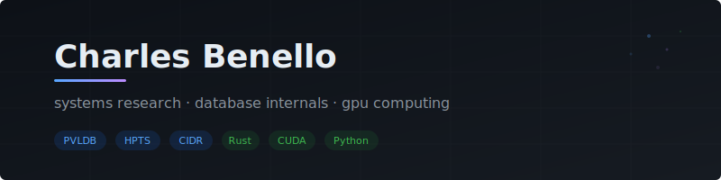

Software engineer and systems researcher at the University of Chicago. I build high-performance systems, database internals, and GPU-accelerated infrastructure. Currently interning at Alter Domus (AI infrastructure for financial services), researching transaction foundation models with PayPal, and continuing database systems research at UChicago's ChiData Lab.

#### Publications

- **CrocSort** - Parallel External Merge Sort | *PVLDB 2026* (equal first author)
- **External Sorting in Cloud/Disaggregated Environments** | *HPTS 2026* (sole author)
- **Resource-Adaptive Query Execution** | *CIDR 2025*

---

[cmbenello.github.io](https://cmbenello.github.io)
